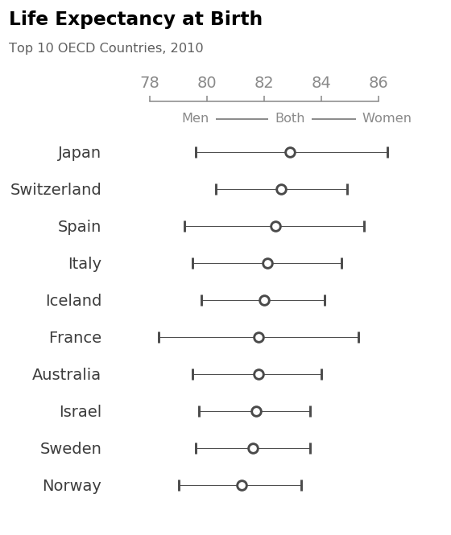

# Purpose
This repository contains my attempts at creating or recreating interesting data visualizations.

## OECD Life Expectancy
This visualization attempts to recreate the dot plot of the top ten countries by life expectancy at birth that Dark Horse Analytics created in their 2012 blog post [[1](https://www.darkhorseanalytics.com/blog/too-many-bars)]. The life expectancy data for this visualization was obtained from the oecd website as comma-separated values [[2](https://data.oecd.org/healthstat/life-expectancy-at-birth.htm)]. A list of OECD member countries was compiled by scraping a list found on the OECD website [[3](https://www.oecd.org/about/members-and-partners/)]. The data listed the countries using ISO country codes. These were converted to full country names by scraping a list of country names and codes from the country code website [[4](https://www.countrycode.org/)].

Recreating the figure was not too difficult. Launching the `create_dotplot` function with the year of interest passed as an argument create the figure. The `get_country_codes` and `get_oecd_members` are used to scrape some of the necessary data from the above listed websites.

Creating a dotplot in matplotlib is not overly difficult: the `matplotlib.pyplot.axes.errorbar` function is used with the combined (`TOT`) life expectancy data passed as the x-variable, the country labels as the y-variable, and the difference between `MEN` and `TOT` and `WOMEN` and `TOT` for the negative and positive error values. Removing unecessary axes and toning down their presence is done with the `set_dotplot_axis_appearance` function. Finally, point labelling is handled by `label_dotplot_points`, which uses the `axes.annotate` and `axes.add_line` functions. Having a basic understanding of how transforms work in matplotlib was necessary to place these labels.

{:height="25%" width="25%"}

Interestingly, when comparing this figure to the original, the order of the countries has changed. E.g., Spain is up from position six to three, and Canada is no longer on the list. Furthermore, the [Statistics Canada post](https://www150.statcan.gc.ca/n1/pub/82-624-x/2011001/article/11427-eng.htm) does say that Canada has been in the top 10 for 50 years, so I may have to review my code. I know I will need to scrape the year of accession to OECD membership from a top 10 OECD to be accurate.

I though it would be interesting to see the life expectancy over time so I created `plot_country_life_expectancy` that sets things into motion. Using Canada and France as examples, we can see that this plots well, although there is still some fine tuning required on the x-axis.

.png){:height="25%" width="25%"}

.png){:height="25%" width="25%"}

